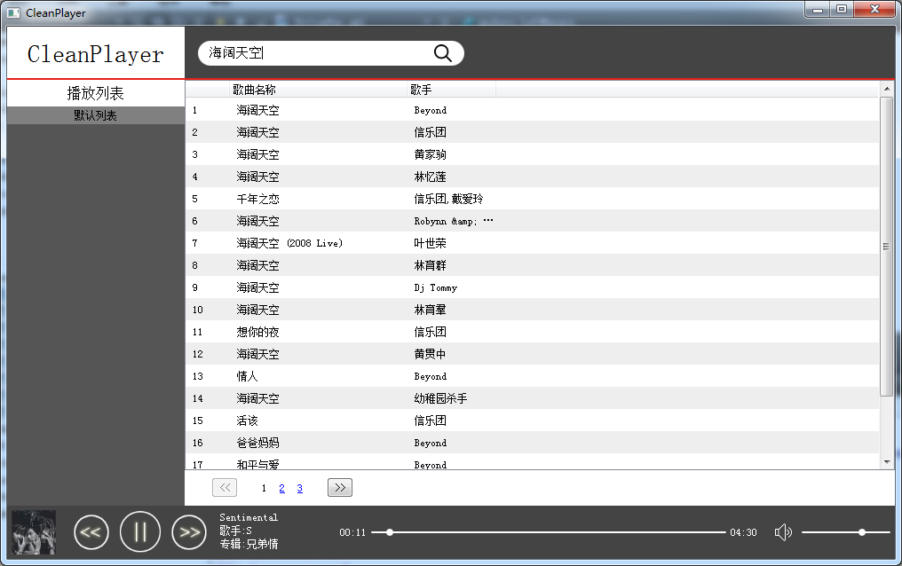
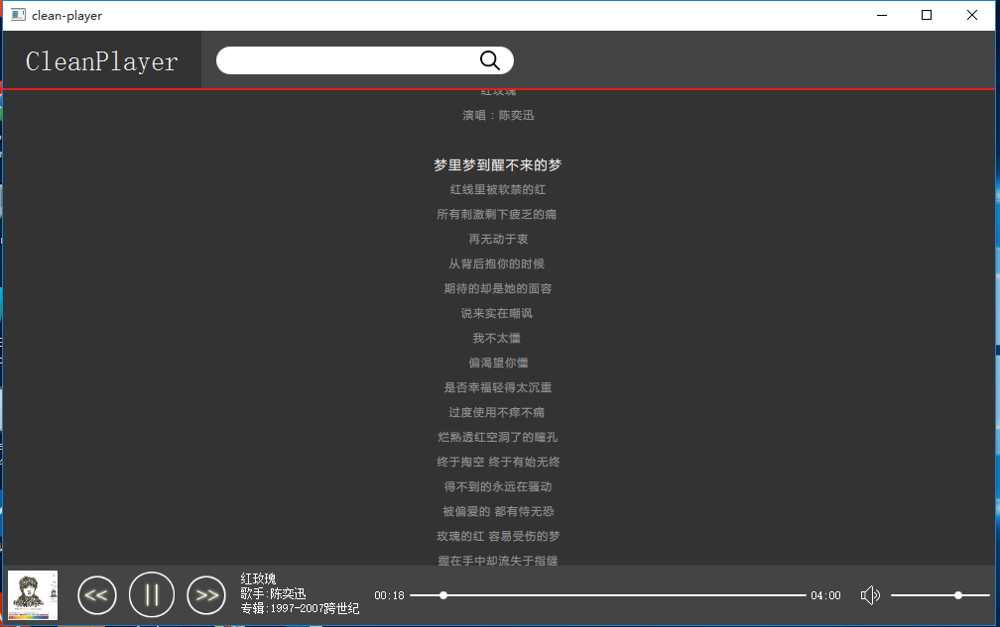

##Clean Player

---
CleanPlayer是Baidu音乐的客户端程序，基于Qt5.4，支持歌曲搜索、在线播放、歌词解析。

### TODO

+ 自定义列表
+ 本地歌曲

### 分支

1. master
    
        git clone https://github.com/pansinm/CleanPlayer.git
        cd CleanPlayer
        git checkout  master

2. dev分支,可能有些新的功能，一般和master一致

        git clone https://github.com/pansinm/CleanPlayer.git
        cd CleanPlayer
        git checkout dev

3. 0.4.2版本，只支持本地歌曲播放，支持在线歌词

        git clone https://github.com/pansinm/CleanPlayer.git
        cd CleanPlayer
        git checkout v0.4.2

###外观

###百度音乐API
+ 搜索建议

        http://sug.music.baidu.com/info/suggestion?format=json&word=关键字&version=2&from=0&callback=函数名
+ 搜索（需要从html中截取有效信息）
    
        http://music.baidu.com/search?key=关键字&start=起始位置&size=20
        起始位置 =（当前页面数-1）× 20
+ 歌曲信息

        http://play.baidu.com/data/music/songinfo?songIds=歌曲id 或
        http://play.baidu.com/data/music/songinfo?songIds=id1,id2,id3
+ 歌曲链接

        http://play.baidu.com/data/music/songlink?songIds=歌曲id&type=m4a,mp3

###其他
1. 基于[QT5.4](http://qt-project.org/downloads)，遵守[LGPL协议](http://www.gnu.org/licenses/lgpl.html)；
2. 软件由QML结合C++编写而成，QML编写界面，C++编写网络、文件读写；
3. 此程序只作为学习交流使用;
4. 旧版Clean Player打包[下载地址](http://pan.baidu.com/s/1bns3lld)；
5. 感谢[Mutse Young](https://github.com/mutse).

